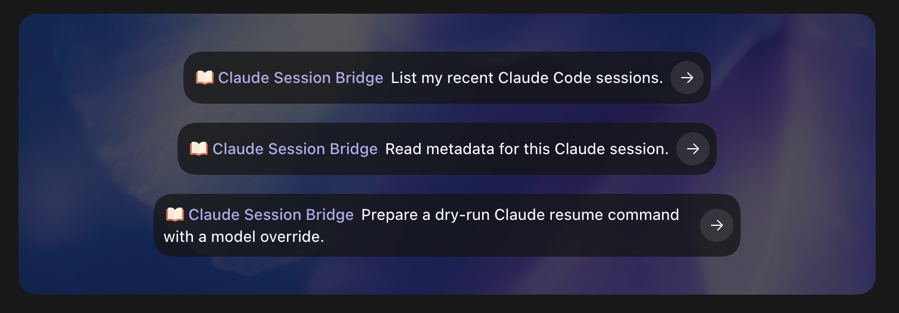
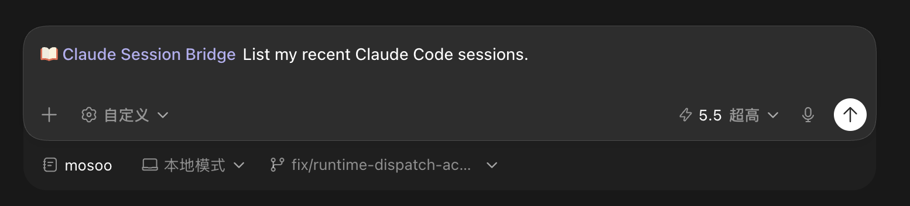
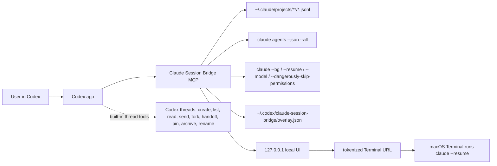

# Claude Session Bridge

Open your local Claude Code sessions inside Codex: list them, inspect transcripts, launch background Claude work, and click back into Terminal.

## Use

```bash
codex plugin marketplace add Yevanchen/claude-session-bridge
codex plugin add claude-session-bridge@claude-session-bridge
```

Then ask Codex:

- "Open my Claude Session Bridge view."
- "Start a Claude background session with model sonnet."
- "Resume this Claude session in Terminal."

## What You Get

- Local Working / Complete / All view for Claude Code sessions.
- Searchable transcript metadata from `~/.claude/projects`.
- Background agent status from `claude agents --json`.
- One-click local Terminal links for `claude --resume`.
- Fresh background sessions with `claude --bg`, `--name`, `--model`, and full-access permissions.
- Codex-side aliases and archive state without editing Claude files.

## Screenshots





## Why

Codex already has first-class thread management: create, list, read, send follow-ups, fork, hand off, pin, archive, and rename threads. Claude Code has a strong local CLI and durable local session history. This plugin bridges those worlds without pretending they are the same system.

The original itch:

> If Codex can scan local Claude Code and manage Claude Code sessions, especially with model selection, that changes the shape of agent collaboration.

The intent is simple: make local agent work visible, resumable, and routable from Codex while leaving Claude Code's own files and CLI in charge.

## Architecture



## How It Works

The plugin is a local MCP server. It scans Claude transcript JSONL files for metadata and bounded previews, reads `claude agents --json` for live/background state, and serves a localhost UI with tokenized Terminal links. Claude-owned transcript files are read-only input; bridge metadata lives in a separate Codex overlay file.

## Tools

- `claude_bridge_view`
- `claude_sessions_list`
- `claude_session_read`
- `claude_session_terminal_link`
- `claude_session_archive`
- `claude_session_unarchive`
- `claude_session_set_alias`
- `claude_background_agents_list`
- `claude_session_resume_background`
- `claude_session_start_background`
- `claude_cli_info`

## Requirements

- macOS for one-click Terminal launch.
- Node.js on `PATH`.
- Claude Code CLI on `PATH`.
- Codex plugin marketplace support.

## Safety

- Does not edit `~/.claude/projects`.
- Stores aliases/archive state under `~/.codex/claude-session-bridge/overlay.json`.
- Terminal links are localhost-only and include a per-process token.
- Background launches default to `dryRun: true` unless explicitly launched.
- Plugin-launched Claude sessions default to `--dangerously-skip-permissions`; only use this on machines and workspaces you trust.
